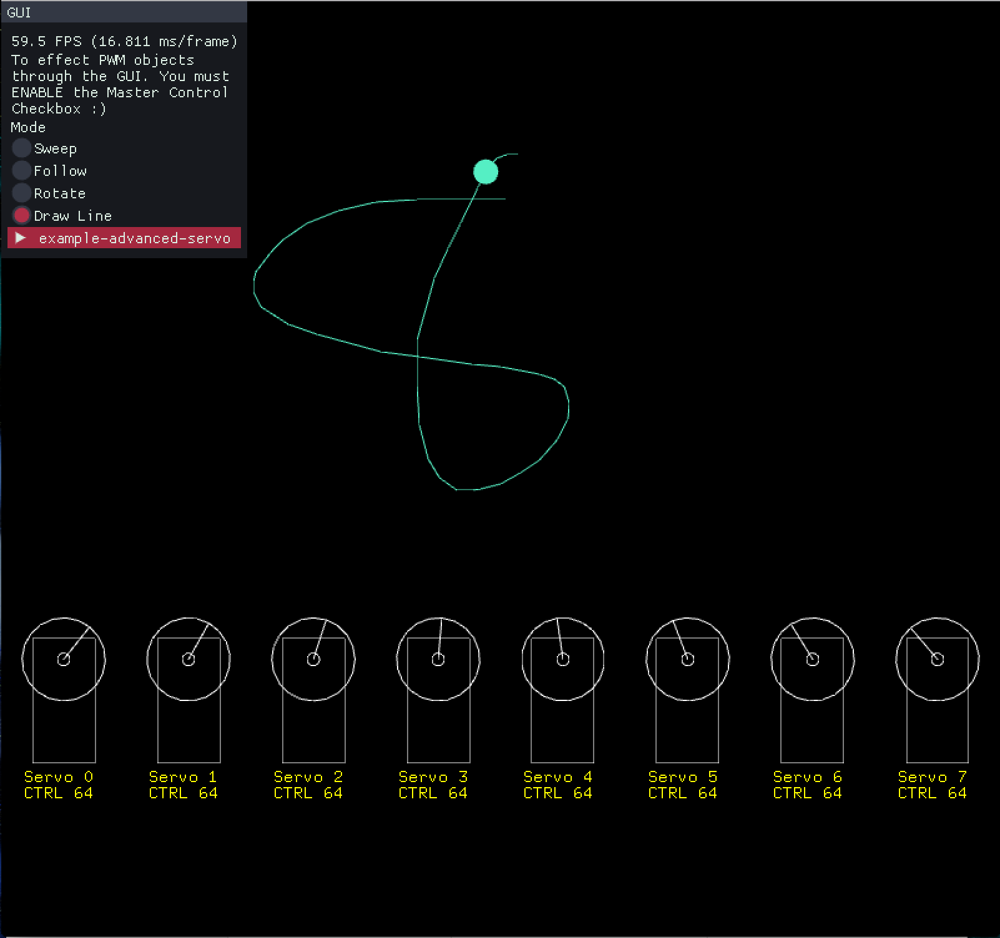

ofxAdafruitPWMBonnet
===

### Overview

A openFrameworks addon for controling [Adafruit's PWM Bonnet](https://www.adafruit.com/product/3416).


**ofxAdafruitPWMBonnet** is an addon for openFrameworks (v0.10.0+) that allows users to control multiple PWM components through Adadfruit's PWM Bonnet for Raspberry Pi.

If you would like to contribute to the addon feel free to fork, hack and mod the code.
Also drop me a line and let me know how you end up using the addon.

[@david_haylock](https://twitter.com/david_haylock)

### Setup

Open Terminal on the Pi.

```
sudo apt-get install python-smbus
sudo apt-get install i2c-tools

$ sudo raspi-config
$ 5 Interfacing Options
$ Enable I2C
$ Finish
$ Reboot
```

Connect the Bonnet to the Pi and Test if it appears
`sudo i2cdetect -y 1`

### Examples 

I've included both ofxImGui and ofxGui in the examples I prefer using ofxImGui as its a bit quicker on the pi, but choose which ever gui you are more comfortable with. 



- **example-simple**: simple control of the pins using a simple gui.
- **example-multiple-bonnets**: control multiple bonnets through the Gui.
- **example-simple-servo**: control one servo with one bonnet.
- **example-multiple-servos**: control multiple servos with one bonnet.
- **example-multiple-servos-multiple-bonnets**: control multiple servos with multiple bonnets.
- **example-advanced-servos**: custom functions with multiple servos.

### Multiple Bonnets

You can stack multiple bonnets on top of each other, I would recommend following [Adafruit's Guide](https://learn.adafruit.com/adafruit-16-channel-pwm-servo-hat-for-raspberry-pi/stacking-hats) on how to stack and address the bonnets.

Then check out the multiple bonnet example.

### Dependencies

You will need ofxGPIO to use the bonnet.

- [https://github.com/kashimAstro/ofxGPIO](https://github.com/kashimAstro/ofxGPIO.git)

For the examples you will need

```
https://github.com/jvcleave/ofxImGui
https://github.com/arturoc/ofxEasing
ofxGui
```

### Thanks

- Folks at Adafruit :)
- [Dario Longobardi](https://github.com/kashimAstro) 
